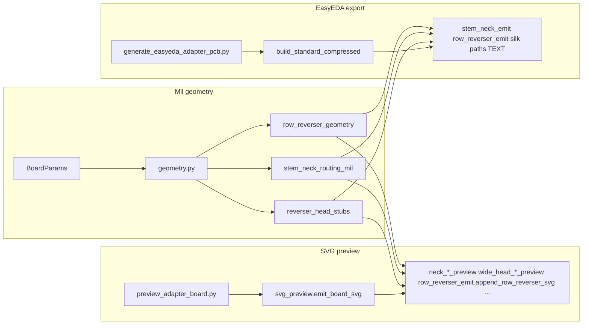

# Architecture: geometry → preview (SVG) vs EasyEDA export

Audience: anyone navigating **`adapter_gen/`** and **`scripts/generate_easyeda_adapter_pcb.py`**. This complements **[preview-generator-parity.md](preview-generator-parity.md)** (product goal) with a **file-level map**.

---

## Big picture

- **One mil geometry model:** **`BoardParams`** and helpers in **`adapter_gen/geometry.py`**, plus routing modules that return polylines/waypoints in **mil (+Y down)**.
- **Two output encodings** (same numbers, different wire format):
  - **SVG preview** — `path` / `polyline`, stroke colors for Top vs Bottom (discussion / review only).
  - **EasyEDA Standard JSON** — `TRACK~`, `PAD~`, `TEXT~`, `VIA~`, `IMAGE~` in **`shape[]`** (product for import).

---

## Geometry and routing (single source of truth)

| Area | Module(s) | Notes |
|------|-----------|--------|
| Board outline, pads, stem layout | **`geometry.py`** | Outline, `head_column_x_mil`, `stem_pin_y_mil`, `wide_head_y_rows_mil`, … |
| Row-A inner reverser | **`row_reverser_geometry.py`** | Polylines + via centers; used by **`row_reverser_emit`** and **`row_reverser_svg.py`**. |
| Wide-head stub → stem | **`reverser_head_stubs.py`** | Stub polylines; preview + EasyEDA stem-neck glue. |
| Stem neck (straddle, J3, left/right stem) | **`stem_neck_routing_mil.py`** | Polylines / waypoint chains; **`stem_neck_emit.py`** turns them into **`TRACK~`**. |
| Layer ids, routing-via diameters (mil) | **`easyeda_layers.py`** | **`EASYEDA_TOP_LAYER_ID`**, **`ROUTING_VIA_*_MIL`**, … |

---

## Preview pipeline (reviewer)

1. **`scripts/preview_adapter_board.py`** — CLI, loads **`BoardProfile`**, **`resolve_board_params`**, calls **`emit_board_svg`**.
2. **`adapter_gen/svg_preview.py`** — Builds SVG: viewBox from **`bounds_mil`**, outline **`board_outline_svg_path_d`**, holes, optional silk/branding, then **copper sketch overlays** in a defined order (see module docstring and comments — e.g. waypoint markers vs full traces).
3. **Overlay modules** (examples): **`row_reverser_emit.append_row_reverser_svg`**, **`neck_j3_bottom_preview`**, **`neck_cyan_waypoints`**, **`wide_head_stub_stem_join_preview`**, **`top_row_cyan_waypoints`** — each focuses on one sketch; **`svg_preview`** orchestrates.
4. **Silk vectors** — **`silk_preview.py`** (paths from baked JSON under **`out/intermediate/silk/`**), **`branding.py`** for overlay.

Optional **developer** decoration (cyan waypoint dots, temp index labels) is off by default — **routing polylines still draw** without it. Pass **`--routing-waypoints`** to **`preview_adapter_board.py`** or set **`routing_waypoint_overlays=True`** in **`emit_board_svg`** for the extra markers. See **`preview_waypoint_style.py`**.

---

## EasyEDA export pipeline (generator)

1. **`scripts/generate_easyeda_adapter_pcb.py`** — CLI, **`main()`** loads profile, calls **`build_standard_compressed`**.
2. **`build_standard_compressed`** — Assembles **`head`** + **`shape[]`**: outline **`board_outline_polyline_mil`**, pads, **`append_row_reverser_easyeda_shapes`**, **`append_stem_neck_*`**, silk **`TEXT`**, branding **`IMAGE`/`TEXT`**, DRC table, etc.
3. **String format** — Segment strings like **`TRACK~stroke~layer~~x1 y1 x2 y2~id~0`** live next to the emitters; **do not** duplicate mil math here—call shared routing helpers first, then format.

---

## Shared inputs

- **Baked silk JSON** — **`scripts/bake_devkitc_gpio_silk_paths.py`** → **`out/intermediate/silk/*.json`**; both preview and generator read the same files for per-pin / board-ID paths.
- **Board TOML** — **`resources/boards/*.toml`** via **`adapter_gen/board_profile.py`**.

---

## Related docs

| Doc | Role |
|-----|------|
| [preview-generator-parity.md](preview-generator-parity.md) | What must match between preview and export |
| [adapter-routing-invariants.md](adapter-routing-invariants.md) | Electrical / geometric intent (no accidental net merges) |
| [python-clean-code.md](python-clean-code.md) | Style, DRY boundaries |
| [CONTRIBUTING.md](../CONTRIBUTING.md) | PR checks and local commands |

---

## When you change routing

1. Prefer changing **mil geometry** in **`geometry` / `*_routing_mil` / `row_reverser_geometry`** first.
2. Update **both** preview appenders and **`*_emit`** if the **copper intent** changes.
3. Run **`./scripts/verify_board_outputs.py --no-branding`** (and refresh baseline if intentional).
